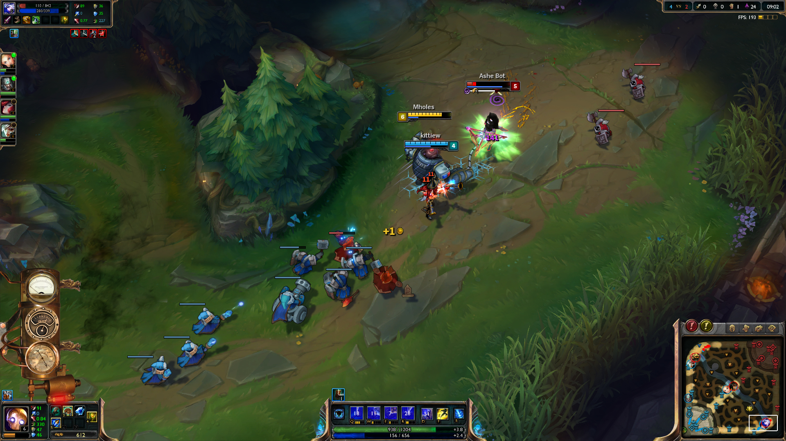
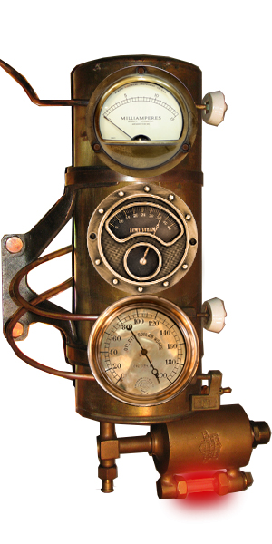

*  

# LoL Charts

#### a League of Legends graphical representation of in-game data.

The app follows a steam punk theme with gauges, dials, steam and fire.
Other apps provide data on any users previous games, but nothing currently exists that will update the user on the current game being played.
 
 
 *the set of three bronze qauges on the left will display data relative to the users-team stats, estimated gold advantage, experience, and relative kills*
 
 
 
 *It is designed to be attractive, visually un-obtrusive, and provide a quick reference. The styling will change to allow the gauges to be read at a quick glance.*
 
# Main Features
This app helps users keep track of their game progress quickly with easy to read visual cues.

### Logitech RGB LED Api Interactivity
* Cooldowns
  - The users ward cooldown, on refresh will illuminate the appropriate key
  - Ability cooldowns will trigger the illumination of their appropriate keys. 
* Ten-key clock.(togglable)
  - The ten-key pad will illuminate displaying a digital clock. 
  - One key will illuminate in the primary color indicating minutes until the assigned event.
  - Up to two additional keys will illuminate to display the seconds. 
  - When the minute and seconds overlap one another(e.g. 5:05, or 4:40), the primary color will change to a tertiary color indicating the overlap.
  - It is an abstract way to display time, however with use it will become very intuitive.
    - It won't be much different than learning to read a face-clock(non-digital). Some people still struggle with this one.
    - Alternatively, I could use the entire left three columns, all five keys to display a larger number, for single seconds, one will stay illuminated in a primary color for the minutes, and another color for the tens of seconds.
    

*clock reads 5:12*

### Real-Time Gold Advantage Graph
* Charts(gauge/dial) that track team gold advantage, based on cs scores. 
* real-time updates so that a team can more easily asses when they are ahead and should be looking to fight.

### Experience Advantage Graph
* Watch the scales tip in your favor as you race to lvl 2 before your opponent.

### Relative kills Graph
* This third chart(gauge/dial) will measure the kills and assists difference and tilt in your favor or the opponents. 

### Jungle alerts
* When your jungler clears their second buff, some lights will flash signifying that they may be ready to gank, therefore the opponent jungler may be ready as well. 
  - instead of lights flashing, we could cause some of the piping to glow yellow, to red, to cherry red hot, indicating potential danger.

### Kill alerts
* When you score a kill, the dragon mouth lets out a spray of steam.
* When a double-kill is achieved the steam includes some black smoke.
* triple-kills: lots of black smoke with some flame glow at the origin
* Quadra-kill: some clean flame flaring up followed by some smoke
* Penta-kill: The dragon ornaments let loose a spray of awesome flame to celebrate your achievement.

There are more features that I have in mind, and I'm sure that the app will grow in time, but the above description is the app in submission ready MVP form.
# Implementation
### Tech Stack
* HTML, CSS, JavaScript
* d3.js (possibly)
* League of Legends API
* Logitech LED API
* OverWolf web SDK
* 3.js (smoke and other visual effects)

### Constraints
* limited performance of JavaScript runtime. I will have to ensure that code is quick and performant
* visual effects might prove difficult. Instead of 3.js. We may use svg' or d3(svg library for charts) to render the gauges and the smoke/fire. I'm concerned that if the fire is rendered svg's, it may distract visually and diverge too far from the native game styling. If we cannot get the svg's looking the way we'd like, we may defer to rendering the smoke in 3.js ( renders multiple layers of a transparent background png, mask it in the shape of a cone, and translate / transform the image across the masked area.)

# Future Versions:
* draggable and lockable positioning.
* Themeable skins.
  - the steam punk skin will work well with champions like Blitzcrank, Heimerdinger, Zilean, Ekko and a few others.
  - a frost themed skin will work well with champions like Anivia, Sejuani, Ashe, Lissandra, etc.
  - a fiery theme will cover several other champions.
